# Worthify

AI-driven used-car valuation prototype built by a multidisciplinary team for the first Greek AI Hackathon, powered by ACEin at the Athens University of Economics and Business.

- **Project period:** November 2023 – May 2024
- **Type:** Team hackathon project
- **Status:** Completed prototype. The original service is no longer live.

[Watch the Worthify platform showcase](https://www.youtube.com/watch?v=8UKhzsqAUYs)

## Goal

Worthify explored how machine learning could make used-car pricing in the Greek market more transparent for individuals, dealers and insurers. A user describes a vehicle (brand, model, year, mileage, engine, fuel and so on) and gets an estimated market value. The concept also included exploratory price forecasting for specific models.

## Architecture

```mermaid
flowchart LR
  subgraph Collection["Data collection (Dec 2023 – Feb 2024)"]
    Links["Link collector<br/>(listing URLs by date)"] --> Server["Socket coordinator<br/>(hands out links)"]
    Server <--> Clients["Scraper clients<br/>(requests + BeautifulSoup)"]
    Clients --> Raw["~91k raw listings (CSV)"]
  end
  subgraph ML["Modelling pipeline (Python)"]
    Raw --> Prep["Cleaning & preprocessing"]
    Prep --> FE["Feature engineering<br/>(incl. DBSCAN location clusters,<br/>brand registration trends)"]
    FE --> Models["scikit-learn models, XGBoost,<br/>LightGBM, CatBoost, AutoGluon"]
    Models --> Eval["Evaluation"]
  end
  subgraph UI["Prototype web app"]
    Web["React UI: valuation form, charts,<br/>heatmap, forecasting views"]
  end
  Eval -. "metrics & feature importance<br/>(static data)" .-> Web
```

The prototype UI was **not wired to live model predictions**. The valuation form collected the inputs, but the result dialog showed a placeholder value. Model results reached the UI as static chart data.

## Data collection

- **Source:** public used-car listings on the Greek marketplace car.gr.
- **How:** Python scrapers built on `requests` and `BeautifulSoup`. A link collector gathered listing URLs by publication date. A page scraper then extracted each listing's attributes: brand and model, registration date, price, condition, category, mileage, fuel, engine size, horsepower, gearbox, colour, doors, seats, location postcode and listing metadata.
- **Distributed setup:** to spread the scraping load, a small multithreaded TCP socket server handed out listing links to several scraper clients. Each client scraped a page and sent the result back as JSON, and the server merged the rows into a single dataset with periodic backups. Access to the server was restricted to the team's machines with a firewall allowlist. A separate daily job collected newly published listings.
- **Volume and dates:** about **91,000 raw listings**, collected between December 2023 and February 2024.
- **Privacy:** the raw data stayed private to the team. The model did not use seller names or free-text descriptions, and no scraped data is published here.

## Cleaning and preprocessing

The raw listings were cleaned with a scripted pipeline (pandas):

- Dropped rows missing brand/model, year, price or mileage, and filled missing condition, seller and description fields with defaults.
- Split each title into **brand**, **model** and **trim/variant** text using a brand dictionary, and parsed dates, prices, mileage, engine size and horsepower from the listing's text fields. Also extracted battery power for electric cars.
- Removed listings that aren't real sale offers: damaged vehicles, "ask for price" listings, "wanted" ads and cars sold for parts.
- Removed duplicates (same URL, or identical listing fields).
- Applied sanity filters: price between €700 and €100,000, used cars with at least 4,000 km, at most 500,000 km, year 1960 or later, engine size at least 400 cc for non-electric cars, and removal of inconsistent engine/horsepower combinations and "other" fuel types.

About **68,800 listings** remained for modelling.

## Feature engineering

- **Vehicle attributes:** mileage, engine size, horsepower, kW, year/month and car age, doors, seats, condition (new/used), VAT-excluded price flag, and whether the seller is a dealer.
- **Categorical encodings:** one-hot encodings for body category, fuel type, gearbox and brand. Model, trim and colour were target-encoded with price statistics.
- **Brand context:** a brand-prestige score, each brand's listing count, and summary statistics (mean, sum, min, max, std, median) of the brand's last 24 months of Greek vehicle-registration figures (monthly SEAA statistics).
- **Location clusters:** listing postcodes were geocoded to coordinates and grouped with **DBSCAN using the haversine distance** (30 km radius). The cluster label was used as a feature.

## Models and training

- **Compared models:** Decision Tree, Random Forest, AdaBoost, Gradient Boosting (scikit-learn), XGBoost, LightGBM and CatBoost, all trained on the engineered feature table with numeric features standardised (the scaler was fitted on the training set only).
- **AutoML:** AutoGluon `TabularPredictor` (regression, optimising mean absolute error), which trains a weighted ensemble of models.
- Model iterations were tracked across feature-set changes. The "accuracy" and "error" charts in the UI plot test R² (× 100) and test mean absolute error (€) over those iterations.

## Evaluation

**Headline result: R² ≈ 0.93, median error ≈ 10% on a leak-free re-evaluation.**

| Metric (held-out 20% test set) | Value |
|---|---|
| R² | 0.927 |
| Median absolute percentage error | 10.2% |
| Mean absolute error | ≈ €1,770 |

Protocol: CatBoost with default settings, trained on the team's pipeline and data with a random 80/20 train/test split. Price-based target encodings (model, trim, colour) were fitted **within folds** of the training set only, and the test set was encoded with statistics from the training set alone.

**Honest note on the original number.** The team's original notebook reported R² 0.977. That figure was inflated because the price-based encodings were computed on the full dataset **before** the train/test split, so test prices leaked into the features. This matters especially for rare trims, where the encoding equals the car's own price. The leak-free re-evaluation above replaces it.

## Frontend

- **Stack:** React (Create React App, converted from a Webflow design), React Router, MUI Autocomplete, Chart.js, Leaflet with a heatmap layer, and Lottie animations.
- **Valuation flow:** a guided form with cascading options (brand → model → specification). The options came from a small backend service that is not preserved.
- **Model-development views:** charts of the model iterations (R² and mean absolute error), feature-importance charts, and brand-distribution pie charts.
- **Geographic view:** a heatmap of where listings are located.
- **Forecasting:** an exploratory time-series view (mean price with upper and lower bands) for selected models, driven by static data. It was a product concept, not a validated forecast.

## Preserved prototype screens

### Guided valuation flow

### Forecasting exploration

### Model-development views

| Iteration score view (test R² × 100) | Error-reduction view (test MAE, €) |
| --- | --- |
|  |  |

These charts show the original notebook's iteration history. They were recorded under the original evaluation protocol, before the leak-free re-evaluation, so they are optimistic.

### Geographic exploration

## What is (and isn't) in this repository

This repository is a public case study only. The source code, scraped data, trained models and retired service endpoints stay private. Worthify was a team project, and product names, visual identity, demo media and project materials appear here for portfolio and historical documentation. See [NOTICE.md](NOTICE.md).

*This write-up was prepared with AI assistance, based on a review of the team's original code and data.*
