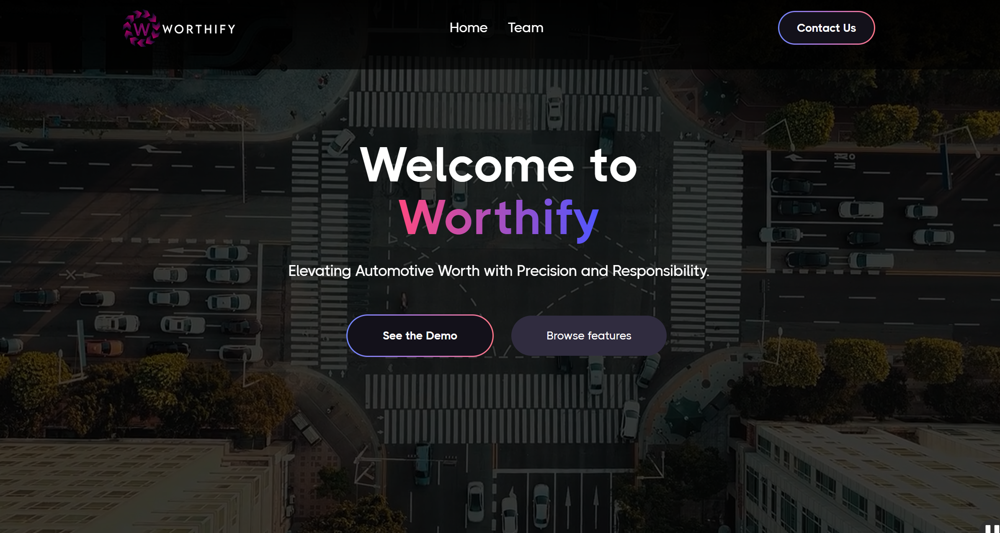
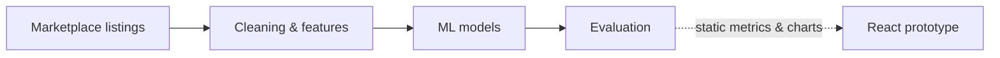
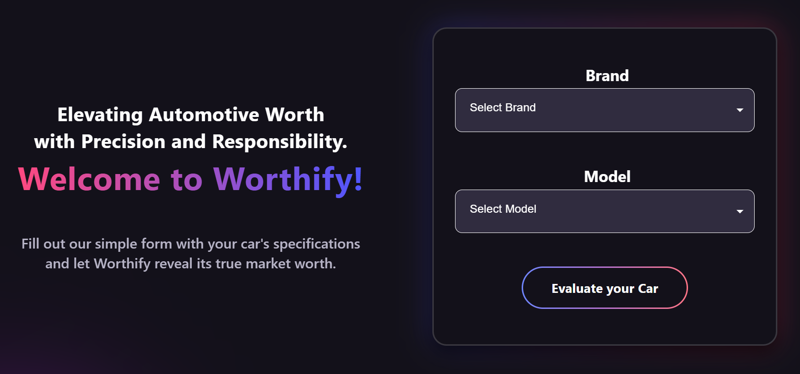
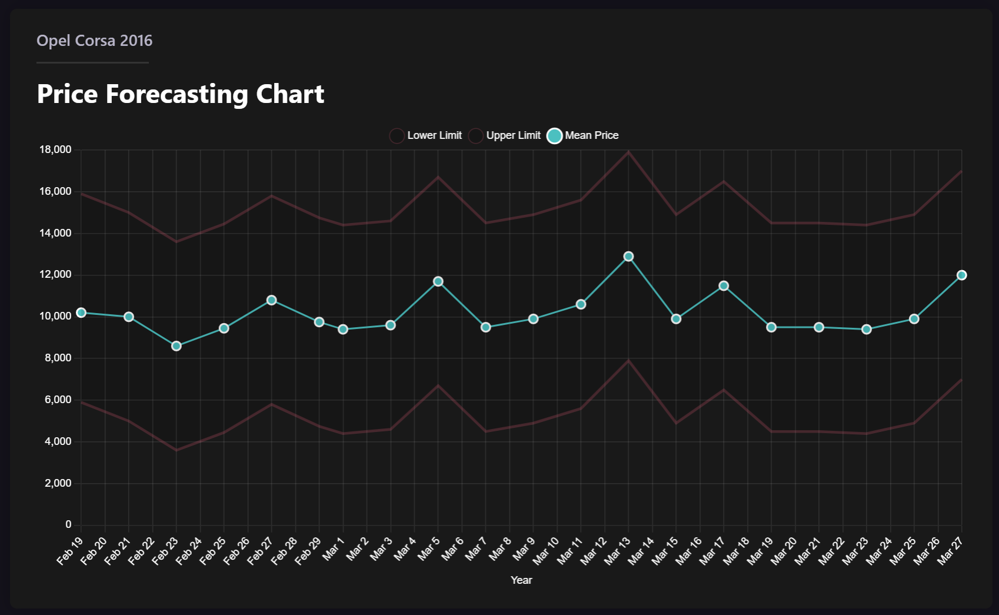
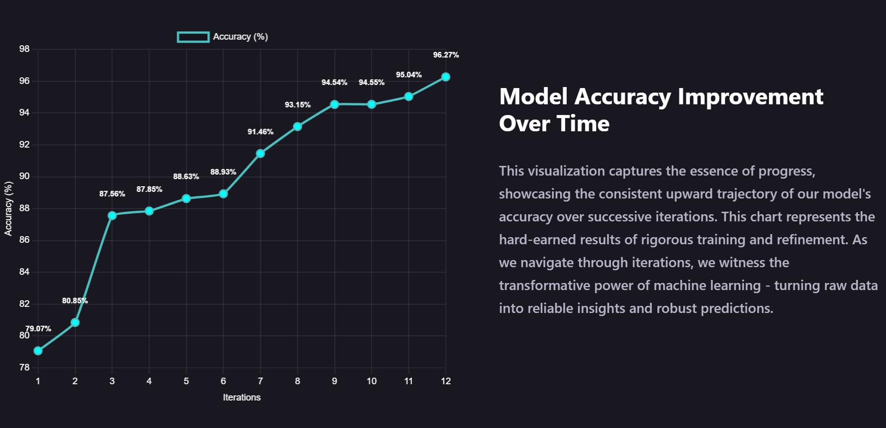
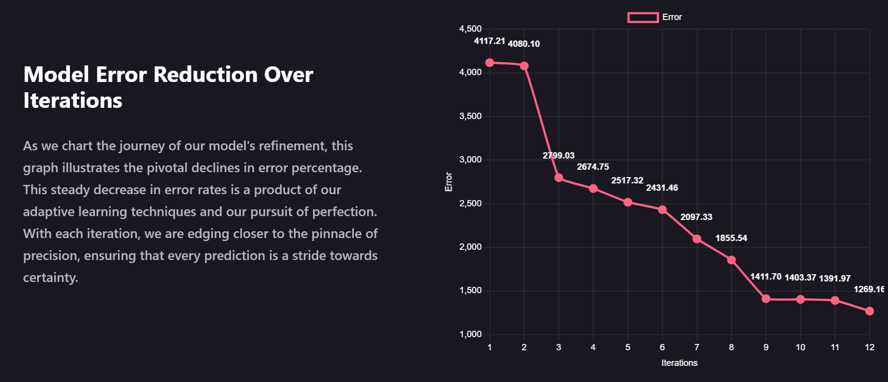
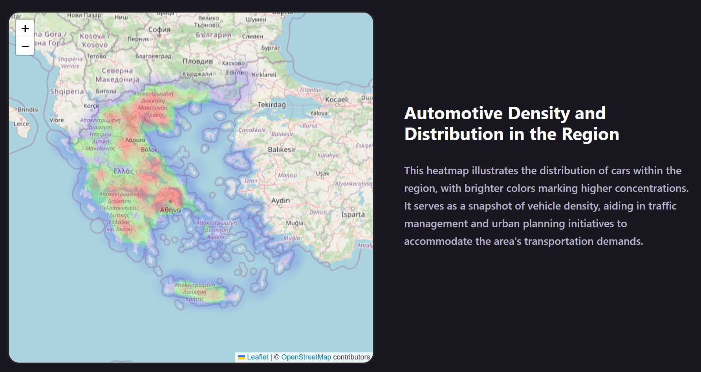

# Worthify

AI-driven used-car valuation prototype built by a multidisciplinary team for the first Greek AI Hackathon, powered by ACEin at the Athens University of Economics and Business.

- **Project period:** November 2023 – May 2024
- **Type:** Team hackathon project
- **Status:** Completed prototype. The original service is no longer live.

[Watch the Worthify platform showcase](https://www.youtube.com/watch?v=8UKhzsqAUYs)

## What it is

Worthify explored how machine learning could make used-car pricing in the Greek market more transparent for individuals, dealers and insurers. A user describes a vehicle (brand, model, year, mileage, engine, fuel and so on) and gets an estimated market value. The concept also included exploratory price forecasting for specific models.

The prototype UI was not wired to live model predictions. The valuation form collected the inputs, but the result dialog showed a placeholder value. Model results reached the UI as static chart data.

## Data

Public used-car listings from the Greek marketplace car.gr, collected with Python scrapers (`requests` and `BeautifulSoup`) between December 2023 and February 2024. About **91,000 raw listings** were gathered; after cleaning (removing incomplete, non-sale, duplicate and out-of-range rows), about **68,800 listings** remained for modelling.

Features included vehicle attributes (mileage, engine, year, condition and so on), categorical encodings for brand, model, trim and colour, brand registration trends from SEAA statistics, and location clusters from postcodes (DBSCAN). The raw data stayed private to the team; no scraped data is published here.

## Model and results

The team compared scikit-learn models, XGBoost, LightGBM, CatBoost and AutoGluon on the engineered feature table.

**Results (CatBoost):** R² ≈ 0.93, median absolute percentage error ≈ 10%, mean absolute error ≈ €1,770. Measured on a held-out 20% test set, with target encodings fitted on the training data only.

## Frontend

React app (converted from a Webflow design) with a guided valuation form, charts of model iterations and feature importance, a Leaflet heatmap of listing locations, and an exploratory forecasting view driven by static data.

## Screens

### Guided valuation flow

### Forecasting exploration

### Model-development views

| Iteration score view | Error-reduction view |
| --- | --- |
|  |  |

### Geographic exploration

## Notes

This repository is a public case study only. The source code, scraped data, trained models and retired service endpoints stay private. Worthify was a team project; product names, visual identity, demo media and project materials appear here for portfolio and historical documentation. See [NOTICE.md](NOTICE.md).

*This write-up was prepared with AI assistance, based on a review of the team's original code and data.*
