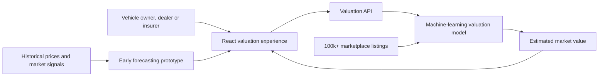

# Worthify

AI-driven used-car valuation prototype created for the first Greek AI Hackathon, powered by ACEin at the Athens University of Economics and Business.

- **Project period:** November 2023 – May 2024
- **My role:** Frontend Developer
- **Status:** Completed hackathon prototype; the original service is no longer live

## The idea

Worthify explored how machine learning could make used-car pricing more transparent for individuals, dealers and insurers. A user supplied a vehicle's characteristics and the prototype returned an estimated market value through a guided web experience.

The longer-term concept also included forecasting: combining historical prices with market signals to explore how the value of a specific model might change over time.

## What we built

- A React-based valuation flow for entering vehicle details
- Integration with a model-backed valuation API
- Interactive views for estimated price, model performance and feature importance
- Market visualizations using charts and geographic data
- An early price-forecasting experience

## Data and model results

The project used more than **100,000 real vehicle listings** collected from online marketplaces.

Team-reported validation results:

- **R²: 0.97**
- **Median absolute percentage error (MdAPE): approximately 6%**

These metrics describe the prototype's validation results; they should not be interpreted as a guarantee for every vehicle or market condition. The forecasting component was an initial exploration rather than a production-validated prediction service.

## Prototype architecture

## My contribution

I worked on the frontend prototype: the user journey, vehicle-input forms, API integration, and the presentation of valuation and forecasting results. The interface used React with Chart.js and Leaflet-based visualizations.

## What the project demonstrated

Worthify showed that a small multidisciplinary team could turn a large vehicle-listing dataset and a trained valuation model into an understandable end-to-end product prototype within a hackathon setting.

The original application source, model implementation, collected data and retired service endpoints are kept private. This repository contains only a concise public case study.

## Project note

Worthify was a team project. Product names, visual identity, demo media and project materials are shown here for portfolio and historical documentation. See [NOTICE.md](NOTICE.md).
